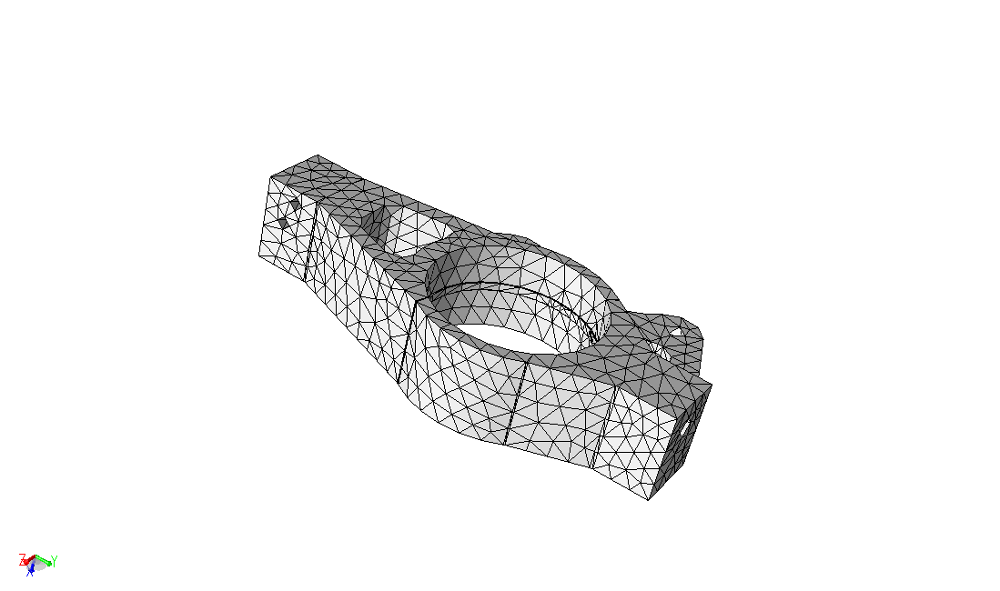

## My Questions

- how do i create links from text to sections or figures?
- how do i add emoji?  Tzanio had a star emoji https://www.webpagefx.com/tools/emoji-cheat-sheet/

## Todo
- replace header - 1400x1600
- setup.sh instead of soft manipulation
- add zoomed upright image of double edge/small face
- add Q/A forms - 'grep qanda' in lessons
- download vtus from lesson github repo - copy/paste 'raw' link
- collapseable Prob Def section? short prob def intro section?
- mention relative size control used for mesh generation

## At A Glance

| Questions                                                   | Objectives                                                                       | Key Points                                                                                                                                                                            | 
| How can I define a simulation on a complex geometric model? | Demonstrate model defeaturing and mesh generation pre-processing tools           | Complex models require robust pre-processing tools!                                                                                                                                   | 
|                                                             | Demonstrate the power of geometric model classification                          | Automated simulation tools designed for scientists and engineers working with real CAD models problem definition information must be specified on the geometric model - not the mesh. | 
| How can I reliably and efficiently execute simulations?     | Demonstrate an adaptive MFEM+PUMI linear elastic analysis with large deformation | Adaptation is critical to automated, robust, and efficient simulation of simulations with transient behavior in which a static mesh defined a-priori will fail.                       | 

Before you begin, first [Open the Answers Form](https://goo.gl/forms/HmuX6HrT0Yfoz7ny2){:target="\_blank"}
in a separate browser tab/window.
We will be entering responses to questions here that are placed throughout the
lesson.

The MFEM+PUMI examples are prepared for execution on Cooley at ALCF.
Except where noted, all commands shown below should be executed in a terminal
logged into Cooley.
In each new terminal first prepare your environment by running the commands
listed in the following section.

Note, each step can be performed independently; we encourage you to go
through them in order though.  If there are issues running the examples, or you
wish to skip ahead you will find the execution output in the `expectedOutput`
directory.

## To begin this lesson

- Ensure that your environment is only using the `@default` packages by running the following commands:
```
cp ~/.soft ~/.soft_bk
echo '@default' > ~/.soft
resoft
mv ~/.soft_bk ~/.soft
```

- Add mvapich2 to your environment
```
soft add +mvapich2-2.3rc1
```

- Copy the example directory to your home directory
```
rsync -aP {{site.handson_install_root}}/mfem-pumi-lesson ~/.
```

- Enter the lesson directory
```
cd ~/mfem-pumi-lesson
```


## Geometric Model Defeaturing

Geometric models are often provided by design engineers and include many
features that are not required for simulation.
The left side of Figure 1 depicts the geometric model of a Tokamak fusion
reactor that has multiple bolts, nuts, and brackets that have no influence on
the frequency analysis.
These features are removed from the Parasolid CAD model by the Simmetrix
SimModSuite tools by calling Parasolid kernel APIs to delete the faces and
'heal' the remaining hole via extensions of the bounding edges and faces.
The right side of Figure 1 depicts the defeatured Tokamak model.
In a model with this level of complexity that engineers and scientists running
the simulation often must coordinate to create the `as-simulated' model.

[](antenna.png)
[](antenna_defeatured.png)

*Figure 1. Initial (left) and defeatured (right) Tokamak antenna geometric model*

For this hands-on we removed a few small faces on the RPI Formula Hybrid
suspension upright shown in Figure 3 to illustrate a few key characteristics of
the mesh generation procedures.

[](figs/upright/all_zmin.png)
[](figs/upright/all_zmax.png)

*Figure 3. RPI Formula Hybrid suspension upright*

[](figs/upright_defeatured/all_zmin.png)
[](figs/upright_defeatured/all_zmax.png)

*Figure 4. RPI Formula Hybrid suspension upright with small faces removed*

In the Mesh Generation step we will generate and compare meshes of the initial
and defeatured geometric models.


### Optional - Run SimModeler to defeature the upright.
Launch the VNC. Run SimModeler. FIXME

## Problem Definition

We will define a tensile loading on the upright by applying a uniform force on
one end (min Z face) and fixing the displacements on the other end (max Z face).
All other geometric model faces will be unconstrained.  No body forces are
applied.

Using geometric classification of the mesh we can define the boundary conditions
on the geometric model without having any knowledge/consideration of the mesh.
Geometric classification defines the equal, or greater, order association of
mesh entities to geometric model entities.
For example, a mesh face can only be classified on a geometric model face or
geometric model region, a mesh edge on geometric edges, faces and regions, 
A very simple text based interface was defined for this demonstration example to
define the two boundary conditions.  To specify the geometric model faces with
the load applied we add one line with `Load` followed by another line with the
number of faces with that load applied.  The geometric model face ids, one per
line, are then listed. Using the same convention we define the fixed faces using
the string `Dirichlet`, the number of listed faces, then the list of face ids.
The boundary condition specification for this example is listed below.
Using the geometric model classification mechanism supports creation of more
feature-rich interfaces (command line, file, GUI).

Geometric classification 

```
$ cat upright.def
Dirichlet
1
43

Load
1
344
```

**Answer Question 1**

## Mesh Generation

Now that we have prepared the model and defined the boundary conditions we can
proceed with mesh generation using the Simmetrix SimModSuite library APIs.
The mesh generation procedures are driven by size controls (e.g., the absolute
length of mesh edges) defined by the user on geometric model entities or defined
within geometric primatives that intersect the model (e.g., cubes, spheres,
cylinders, etc.).
The mesh generator is automated, which in the domain of mesh generation means
that it will always produce a valid mesh while doing its best to respect the
user specified controls.
Note, the features of the geometric model highly dictate what mesh sizes are
possible.
Specifically:
- the mesh topology must exactly respect the geometric model topology, 
i.e., each geometric model vertex has at least one mesh vertex classied on it.
- the geometry of the mesh (e.g., the position of the vertices or curvature of
faces) is *always* an approximation to the geometric model.

Once the mesh is generated we convert it, in-memory (i.e., using PUMI and
SimModSuite APIs), to a PUMI mesh and then write the PUMI mesh to file.

**Answer Question 2**

```
qsub -I -n 1 -t 30 -A ATPESC2018 -q training
cd ~/mfem-pumi-lesson/meshGeneration
# generate the mesh on the initial geometric model and create paraview vtu files
./generate --native-model=upright.x_t upright.smd 5kg1
./render upright.x_t 5kg1/ 5kg1_initial_vtu
# generate the mesh on the defeatured model and create paraview vtu files
./generate upright_defeatured_geomsim.smd 5kg1
./render upright_defeatured_geomsim.smd 5kg1/ 5kg1_defeatured_vtu
```

[](figs/upright/5kg1_all_zmax.png)
[](figs/upright/5kg1_all_zmin.png)

*Figure 4. Mesh of initial upright model*

[](figs/upright_defeatured/5kg1_all_zmax.png)
[](figs/upright_defeatured/5kg1_all_zmin.png)

*Figure 5. Mesh of defeatured upright model*

### Optional - Visualize the Initial Meshes
Download the `.*vtu` files from [Here - FIXME](https://goo.gl/forms/HmuX6HrT0Yfoz7ny2), or
use a file transfer utility (e.g., `scp`, `rsync`, `putty`, etc.) to copy them to your local machine.

---

This concludes the day time hands-on.
In the evening you'll have an opportunity to repeat these steps and follow two
additional steps before running the adaptive analysis.

---

## Partitioning

Efficient parallel execution requires equally distributing the units of work among the
processing resources while keeping communication costs low.
The multi-level graph and recursive sectioning geometric methods are among the
most commonly available and used methods for partitioning unstructured meshes.
In this lesson we will exercise the multi-level graph partitioner (refered to as
'graph' below) provided by the Zoltan interface and implemented by ParMETIS.
We will then run recursive coordinate bisection ('RCB') and recursive inertial
bisection ('RIB') to produce meshes of with the same part count (number of
sub-domains), and compare the results.
All three partitioners are targeting an imbalance of 5%; defined as
the max element count on any part divided by the average element count across
all parts.

```
qsub -I -n 1 -t 30 -A ATPESC2018 -q training
cd ~/mfem-pumi-lesson/partition
runParma=0
isLocal=0
render=1
mdl=upright_defeatured_geomsim.smd
mesh=5kg1_defeatured/
mpirun -np 4 ./ptnParma $mdl $mesh 5kg1_p4_parmetis/ 4 pmetis kway $isLocal $runParma $render &> graph.out
mpirun -np 4 ./ptnParma $mdl $mesh 5kg1_p4_rcb/ 4 rcb ptn $isLocal $runParma $render &> rcb.out
mpirun -np 4 ./ptnParma $mdl $mesh 5kg1_p4_rib/ 4 rib ptn $isLocal $runParma $render &> rib.out
```

The entity imbalance information is listed on the lines containing `entity
imbalance <v e f r>:`.
The imbalance values follow the definition given above (`max count/avg count`);
i.e., 5% imbalance will be listed as `1.05`.

The number mesh entities that are shared with other processes is indirectly
indicated on the lines containing `weighted TYPE <tot max min avg>` where `TYPE`
is `vtx`, `edge`, or `face`.
If the total (`tot`) or average (`avg`) number of entities of a given TYPE is
larger relative to another partition then that partition has more replicated
entities.

Given the values of the imbalance and shared entity count for each partition
(graph, RCB, RIB) above and the content of the `[graph|rcb|rib].out` files,
**Answer Questions 3, 4, and 5**.

The partitioning descisions of RIB and RCB are based on the centroid of mesh
elements while the multi-level graph partitioner is using mesh adjacency
information (graph vertex = mesh element, graph edge = mesh face shared by
two mesh elements).
Based on this, and Figure 6, **Answer Question 6**.

[](figs/pmetis-rcb-rib.png)

*Figure 6. Partitions created with multi-level graph (left), RCB (middle), and RIB (right)*

### Optional - Visualize the Partitioned Meshes
Download the `*vtu` files from [Here]( https://goo.gl/forms/HmuX6HrT0Yfoz7ny2), or
use a file transfer utility (e.g., `scp`, `rsync`, `putty`, etc.) to copy them
to your local machine.

## Adaptive Simulation

This problem solves a linear elasticity model on a cantilever beam.
Specifically, we approximate the weak form of 
$$-\div(\sigma(u))=0$$ 
where
$$\sigma(u)=\lambda*\div(u)*I+\mu*(\nabla*u+u*\nabla)$$
is the stress tensor corresponding
to displacement field $u$, and $$\lambda = 1$$ and $$\mu = 1$$ are the material
Lame constants.

The boundary conditions are u = 0 on the left end of the model and a pull force
f = 1.0 e-2 on the right end.
The model ID of these boundary faces are provided as the input and by means of
reverse classification the mesh faces classified on these model faces are
detected and the BCs are applied.
We want to perform a mesh adaptation on this example.
We first solve on the initial mesh, then perform a mesh adaptation and then
solves again on the new mesh.
After solving the problem on the initial mesh, a Superconvergent Patch Recovery
(SPR) error estimation is performed to get the size field based on which the
adaptation is done.
SPR basically computes a reference solution on the patch of elements based on
the gradients of the solution fields at the element Gauss points and then
compare the FE solution with it to measure the error at each element.
This error is then scaled by a factor (adapt- ratio) which says what percentage
of the error is acceptable and then a size field is generated.
MeshAdapt takes this size field and generate a new mesh that respects this
field.

With the geometry in hand, we expect that the upper portion of the ring
experiences higher stresses as the model is not symmetric and the lower part is
much stiffer.
Given this intuition we would expect higher error there and therefore a finer
mesh is expected as the result of the meshAdapt.
This can be seen comparing the initial mesh and the final mesh which is the
outcome of the meshAdapt.

```
cd ~/mfem-pumi-lesson/analysis
mpirun -np 4 .
/pumi_upright_ex2p -p upright_defeatured_geomsim.smd -bf upright.def -m 5k1g_p4_parmetis/
mpirun -np 4 ./pumi_upright_ex2p -p upright_defeatured_geomsim.smd -bf upright.def -m 5k1g_p4_rcb/
mpirun -np 4 ./pumi_upright_ex2p -p upright_defeatured_geomsim.smd -bf upright.def -m 5k1g_p4_rib/
```


[](figs/uprightMesh/initial.png)
[](figs/uprightMesh/final.png)
[](figs/uprightMesh/initial_displacement.png)
[](figs/uprightMesh/final_displacement.png)

*Figure 6. Initial (left) and final (right) mesh (top) and displacement field
(bottom).*

**Answer Question 7**

## Out-Brief

Here, re-emphasize the lesson objectives and key points.


Its fine to go into greater detail about questions or objectives this lesson
did not fully cover.

### Further Reading

Include links to other online sources you might want to include.

* SCOREC tools
  * C. W. Smith, M. Rasquin, D. Ibanez, K. E. Jansen, and M. S. Shephard **Improving Unstructured Mesh Partitions for Multiple Criteria Using Mesh Adjacencies**,  SIAM Journal on Scientific Computing, 2018. DOI: 10.1137/15M1027814
  * M. Zhou, O. Sahni, T. Xie, M.S. Shephard and K.E. Jansen, **Unstructured Mesh Partition Improvement for Implicit Finite Element at Extreme Scale**, Journal of Supercomputing, 59(3): 1218-1228, 2012. DOI 10.1007s11227-010-0521-0
  * M. Zhou, T. Xie, S. Seol, M.S. Shephard, O. Sahni and K.E. Jansen, **Tools to Support Mesh Adaptation on Massively Parallel Computers**, Engineering with Computers, 28(3):287-301, 2012. DOI: 10.1007s00366-011-0218-x
  * M. Zhou, O. Sahni, M.S. Shephard, K.D. Devine and K.E. Jansen, **Controlling unstructured mesh partitions for massively parallel simulations**, SIAM J. Sci. Comp., 32(6):3201-3227, 2010. DOI: 10.1137090777323
  * M. Zhou, O. Sahni, H.J. Kim, C.A. Figueroa, C.A. Taylor, M.S. Shephard, and K.E. Jansen, **Cardiovascular Flow Simulation at Extreme Scale**, Computational Mechanics, 46:71-82, 2010. DOI: 10.1007s00466-009-0450-z

* Partitioning
  * Zoltan 
  * ParMETIS multi-level graph

* Mesh data and geometry interactions
  * Seol, E.S. and Shephard, M.S., **Efficient distributed mesh data structure for parallel automated adaptive analysis**, Engineering with Computers, 22(3-4):197-213, 2006, DOI: 10.1007s00366-006-0048-4
  * Beall, M.W., Walsh, J. and Shephard, M.S, **A comparison of techniques for geometry access related to mesh generation**, Engineering with Computers, 20(3):210-221, 2004, DOI: 10.1007s00366-004-0289-z. 
  * Beall, M.W. and Shephard, M.S., **A general topology-based mesh data structure**, Int. J. Numer. Meth. Engng., 40(9):1573-1596, 1997, DOI: 10.1002(SICI)1097-0207(19970515)40:9<1573::AID-NME128>3.0.CO;2-9.

* Adaptivity
  * "Aleksandr Ovcharenko, **Parallel Anisotropic Mesh Adaptation with Boundary Layers**, Ph.D. Dissertation, RPI, 2012":http://www.scorec.rpi.edu/REPORTS/2012-20.pdf 
  * Q. Lu, M.S. Shephard, S. Tendulkar and M.W. Beall, **Parallel Curved Mesh Adaptation for Large Scale High-Order Finite Element Simulations**, Proc. 21 Roundtable, Springer, NY, pp. 419-436, 2012, DOI 10.1007978-3-642-33573-0.
  * A. Ovcharenko, K. Chitale, O. Sahni, K.E. Jansen and M.S. Shephard, S. Tendulkar and M.W. Beall, **Parallel Adaptive Boundary Layer Meshing for CFD Analysis**, Proc. 21st International Meshing Roundtable, Springer, NY, pp. 437-455, 2012, DOI 10.1007978-3-642-33573-0
  * X.-J. Luo, M.S. Shephard, L.-Q. Lee and C. Ng, **Moving Curved Mesh Adaption for Higher Order Finite Element Simulations**, Engineering with Computers, 27(1):41-50, 2011. DOI: 10.1007/s00366-010-0179-5
  * O. Sahni, X.J. Luo, K.E. Jansen, M.S. Shephard, **Curved Boundary Layer Meshing for Adaptive Viscous Flow Simulations**, Finite Elements in Analysis and Design, 46:132-139, 2010. DOI: 10.1007/s00366-008-0095-0
  * Alauzet, F., Li, X., Seol, E.S. and Shephard, M.S., **Parallel Anisotropic 3D Mesh Adaptation by Mesh Modification**, Engineering with Computers, 21(3):247-258, 2006, DOI: 10.1007s00366-005-0009-3
  * Li, X., Shephard, M.S. and Beall, M.W., **3-D Anisotropic Mesh Adaptation by Mesh Modifications**, Comp. Meth. Appl. Mech. Engng., 194(48-49):4915-4950, 2005, doi:10.1016/j.cma.2004.11.019
  * Li, X., Shephard, M.S. and Beall, M.W., **Accounting for curved domains in mesh adaptation**, International Journal for Numerical Methods in Engineering, 58:246-276, 2003, DOI: 10.1002/nme.772
